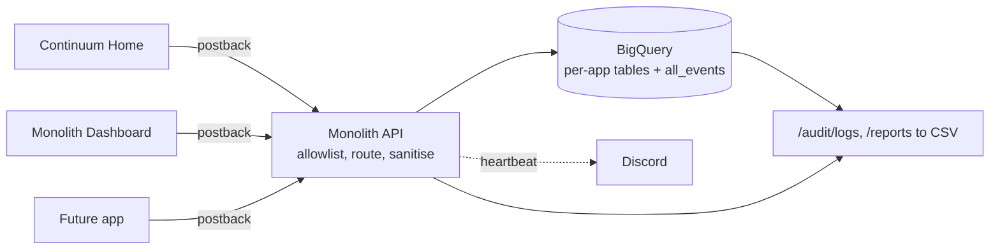

<h1 align="center"> Monolith API — One Audit Trail for Every App You Ship </h1>
<h1 align="center">

  <br>
  <div>
    <a href="https://github.com/fal3n-4ngel/Monolith-API/issues">
        
    </a>
    <a href="https://github.com/fal3n-4ngel/Monolith-API/stargazers">
        
    </a>
    <a href="https://github.com/fal3n-4ngel/Monolith-API">
        
    </a>
    <a href="https://github.com/fal3n-4ngel/Monolith-API/blob/main/LICENSE">
        
    </a>
    <br>
    </div>

   </h1>

## What is Monolith API?

Monolith API is the ingestion engine and audit warehouse behind a small family of personal apps — [Continuum Home](https://github.com/fal3n-4ngel/Continuum-Home), the Monolith dashboard, and whatever comes next. Each app fires a server-to-server postback whenever a user record changes; Monolith validates it against a fixed allowlist, routes it to a per-app, per-domain BigQuery table, and drops a one-line heartbeat into Discord so a deploy can be eyeballed as working.

It exists because every app was keeping its own history in its own silo. Now there's one place to ask "what happened to this record, and who touched it" across the whole ecosystem, and one place to run reports without exporting from four databases by hand.

Full API reference, credential setup, and report authoring live at **[monolith.adithyakrishnan.com](https://monolith.adithyakrishnan.com)**.

## Technical Details

```
Language:   Java 21 + Spring Boot 3.3
Warehouse:  Google BigQuery — per-app, per-domain tables unioned by an all_events view
Hosting:    GCP Cloud Run — monolith-postbacks.adithyakrishnan.com
Auth:       Static bearer keys from a checked-in registry (no per-app secrets),
            or an allow-listed Google ID token
Telemetry:  Discord webhook heartbeats
Build:      Multi-stage Docker, CDS archive for cold start, --min-instances=0
```

## Features

- **Fail-closed ingest.** `POST /api/v1/events/postback` — an app or event type outside the `apps.json` allowlist returns `400` and stores nothing; a missing API key rejects every request rather than falling open.
- **Scoped audit-log reads.** `GET /api/v1/audit/logs` — newest-first history, confined server-side to the calling credential's app. A client key cannot read another app's events.
- **Admin-authored reports.** `GET /api/v1/reports` + `POST /api/v1/reports/{id}/run` — a checked-in catalog of parameterised `SELECT`s, run on demand and streamed back as CSV. No arbitrary SQL crosses the wire.
- **Onboarding is one file.** A new app is a block in `apps.json` and a merge — no code change. On boot the BigQuery tables and the `all_events` view self-provision, and the app's key derives from its id (no Secret Manager change).
- **Payload hardening.** Entry count, value length, and nesting depth are bounded; credential-shaped keys are redacted before anything reaches BigQuery.
- **Off the request thread.** BigQuery inserts and Discord posts run async — telemetry never adds latency to, or fails, the flow it observes.
- **Layered rate limiting.** A generous per-IP budget on everything, tighter per-IP *and* per-credential budgets on ingest and on each BigQuery-backed read.

## Project Structure

```
src/main/java/com/dashboard/api/
├── config/       # Security filter chain, rate limiting, OpenAPI, typed properties
├── controller/   # postback · audit-log · reports · health
├── events/       # AppRegistry — the app + event allowlist and table routing, from apps.json
├── ingest/       # BigQuery inserts + startup schema provisioner, payload sanitiser, clock skew
├── query/        # Audit-log read path — parameterised, scoped per credential
├── reports/      # Report catalog, startup validation, BigQuery runner
├── security/     # Client registry, derived key map, authenticated principal
└── notify/       # Discord heartbeat
src/main/resources/
├── apps.json     # registered apps → domains + event names (drives routing + BigQuery provisioning)
├── clients.json  # owner key + cross-app consumers → read scope + report allotment (no secrets)
└── reports.json  # admin-authored parameterised SELECT catalog
```

## Architecture

Every event is emitted **server-to-server** by a source app's own backend, after a write has already committed there — never from a browser. That is why the endpoint can demand a credential, and does: the whole value of the warehouse is that its rows are trustworthy.

An accepted postback is routed by `eventType` to `events.<app>_<domain>` — callers name an event, never a table. The app + event allowlist and that routing come from `apps.json`; a new app is a block there and a merge, and the deploy self-provisions its BigQuery tables and rebuilds `all_events`. Every domain table shares one column set, so `all_events` unions them into a single query shape no matter which app or domain you start from. Reads (`/audit/logs`, `/reports`) go back through the same bearer auth; the credential decides which `source_app` the results are confined to. Reports bind their parameters, cap bytes billed, and filter to production events.

Onboarding a new app: [`APP_INTEGRATION_GUIDE.md`](APP_INTEGRATION_GUIDE.md).



## Run Locally

### Clone

```bash
git clone https://github.com/fal3n-4ngel/Monolith-API.git
cd Monolith-API
```

### Prerequisites

- JDK 21 (the suite also runs on newer JDKs — see `pom.xml`)
- For BigQuery writes: `gcloud auth application-default login` with access to the target project. Without credentials the app still boots — writes are skipped and logged.

### Test

```bash
mvn test
```

### Run

```bash
API_KEY=local-dev-key mvn spring-boot:run
```

Local config lives in `.env` (git-ignored); the full variable list is on the docs site.

## Security Model

- **Fails closed.** No key configured → every authenticated request is rejected, loudly, at startup.
- **No per-app secrets.** Every app's key is an HMAC of its id under one root seed (`MONOLITH_KEY_SEED`), recomputed at auth time — nothing stored. An optional `MONOLITH_CLIENT_KEYS` secret can pin a non-derived key; nothing uses it today. Onboarding adds no Secret Manager entry or version.
- **Header-only credentials**, compared in constant time. There is no `?key=` query fallback — that leaked into request logs and downstream `Referer` headers.
- **Per-app read isolation.** `source_app` is set from the authenticated credential, not a request parameter; asking for another app is a `403`.
- **Structure, not content.** Payloads carry amounts, categories, and IDs — not free-text personal data — and are sanitised on the request thread before leaving it.

## Deployment

Pushes to `main` run the suite, build a multi-stage image, deploy to Cloud Run, and poll `/health` on the new revision before the job is allowed to pass. Secrets come from Google Secret Manager and must exist before the first deploy. Details on the docs site.

# Contributors

<table>
<tr>
    <td align="center">
        <a href="https://github.com/fal3n-4ngel">
            
            <br />
            <sub><b>Adithya Krishnan</b></sub>
        </a>
    </td>
   </tr>
</table>

## License

Open-source under the [MIT License](LICENSE).

---

## 📝 Authors' Note

> This one isn't really a product — it's the plumbing. Telemetry was scattered across every personal app, each writing to its own database, and there was no way to answer a plain "who did what, when" without opening four projects.
>
> So I pulled the audit trail out of the apps entirely. They fire-and-forget an event now; Monolith owns the schema and the warehouse, and the apps don't carry that weight. The credential and report machinery grew from there — mostly from wanting to hand a friend a scoped view without handing over the keys.

<a href="https://www.buymeacoffee.com/fal3n-4ngel" target="_blank"></a>
